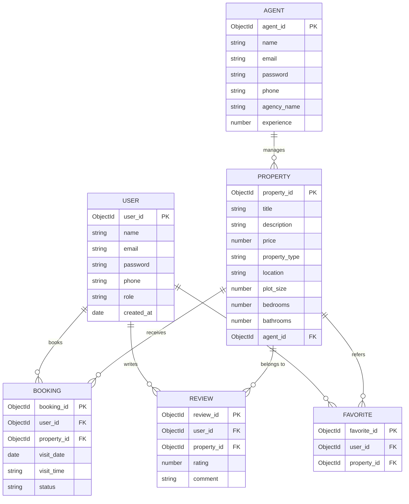

# Real Estate Property Management System (MERN)

Full-stack MERN project for managing real estate listings including residential plots, agricultural land, commercial land, apartments, and houses.

## Features

- Property CRUD: create, list, details, update, delete
- Plot/land fields: plot size, dimensions, road access, facing, zoning, utilities
- Advanced filters: location, type, listing mode, price, plot size, facing, zoning, road access
- Map-ready coordinates (latitude/longitude)
- Enquiry workflow
- Site visit booking workflow
- Favorites (saved listings) in frontend local storage
- Seed script with sample data

## Tech Stack

- Frontend: React + Vite + React Router + Axios
- Backend: Node.js + Express + MongoDB + Mongoose
- Database: MongoDB (local or Docker)

## Project Structure

```text
.
|-- backend
|   |-- src
|   |   |-- app.js
|   |   |-- server.js
|   |   |-- config/db.js
|   |   |-- controllers/
|   |   |-- middleware/
|   |   |-- models/
|   |   |-- routes/
|   |   `-- utils/seed.js
|   `-- package.json
|-- frontend
|   |-- src
|   |   |-- api/client.js
|   |   |-- components/
|   |   |-- context/
|   |   |-- pages/
|   |   |-- constants.js
|   |   |-- utils.js
|   |   `-- styles.css
|   `-- package.json
|-- docker-compose.yml
`-- package.json
```

## ER Diagram



### ER Diagram Summary Table

| Entity    | Purpose                   |
| --------- | ------------------------- |
| User      | Buyers and renters        |
| Agent     | Property managers         |
| Property  | Houses, plots, apartments |
| Booking   | Visit scheduling          |
| Review    | User feedback             |
| Favorites | Saved properties          |

## API Endpoints

### Property APIs

- `GET /api/properties`
- `GET /api/properties/:id`
- `POST /api/properties`
- `PUT /api/properties/:id`
- `DELETE /api/properties/:id`

### Inquiry APIs

- `GET /api/inquiries`
- `POST /api/inquiries`
- `PATCH /api/inquiries/:id/status`

### Visit APIs

- `GET /api/visits`
- `POST /api/visits`
- `PATCH /api/visits/:id/status`

## Filters for `GET /api/properties`

- `keyword`
- `location`
- `propertyType`
- `listingType`
- `minPrice`, `maxPrice`
- `minPlotSize`, `maxPlotSize`
- `facing`
- `zoningType`
- `roadAccess` (`true` or `false`)
- `page`, `limit`
- `sortBy` (`createdAt`, `price`, `landDetails.plotSize`, `title`)
- `sortOrder` (`asc`, `desc`)

Example:

```http
GET /api/properties?location=Bangalore&propertyType=Residential%20Plot&minPlotSize=1200&maxPlotSize=2400&minPrice=2000000&maxPrice=4000000
```

## Setup and Run

### 1) Install dependencies

```bash
npm install
npm run install:all
```

### 2) Configure environment files

PowerShell:

```powershell
Copy-Item backend/.env.example backend/.env
Copy-Item frontend/.env.example frontend/.env
```

macOS/Linux:

```bash
cp backend/.env.example backend/.env
cp frontend/.env.example frontend/.env
```

### 3) Start MongoDB

Option A: Use local MongoDB service

Option B: Use Docker

```bash
docker compose up -d
```

### 4) Seed data (optional)

```bash
npm run seed
```

### 5) Run app

```bash
npm run dev
```

- Frontend: `http://localhost:5173`
- Backend: `http://localhost:5000`

## Demo Flow

1. Browse and filter by `Residential Plot`.
2. Open details and show land attributes.
3. Show map and coordinates.
4. Submit enquiry and request site visit.
5. Add a new listing from the form.

## Notes

- Map preview currently uses OpenStreetMap embed plus a Google Maps deep link.
- You can switch to Google Maps API by replacing `MapPreview` implementation.
